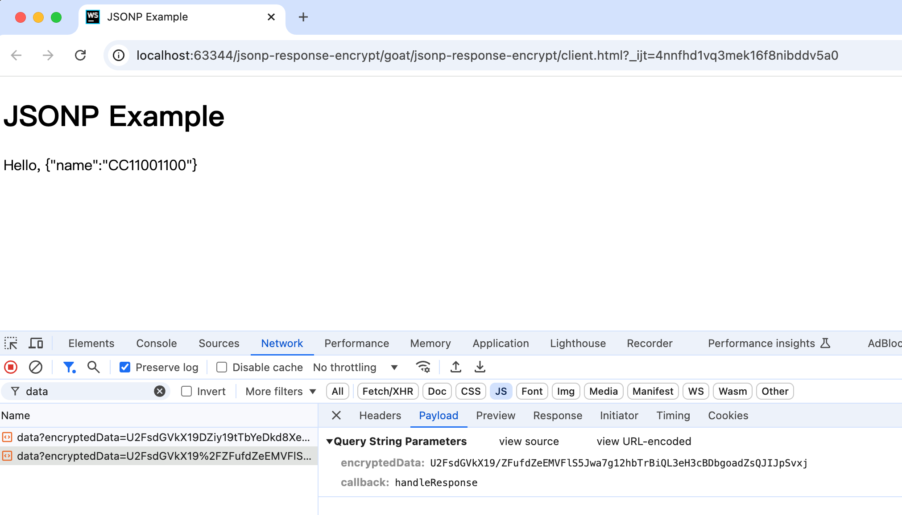
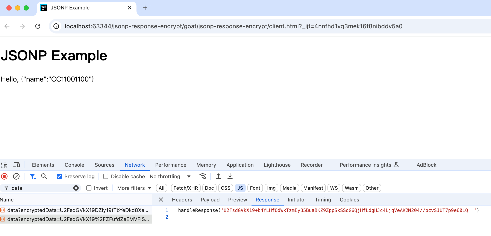

# JSONP加密通信破解靶场

# 一、靶场简介
这是一个靶场，用于演示一个页面，通过jsonp与后端通讯，并且通讯内容是加密的，这是请求：



响应：



而我们的目标就是借助js-script-hook来分析明白前后端通讯的逻辑。

# 二、启动靶场

启动server：

```bash
node main.js
```

打开前端页面：

```bash
client.html
```

# 三、分析


